<div align="center">

# HamidOS

**پورتفولیویی که می‌شود با آن کار کرد.**

دنیای شخصی حمید شیخی؛ یک دسکتاپ در مرورگر، با پنجره‌های تعاملی، شیشه‌های محو و تجربهٔ جداگانهٔ گوشی.


[گالری تصاویر](#gallery) · [امکانات](#features) · [اجرای محلی](#start) · [ساختار پروژه](#architecture) · [بررسی و تست](#checks)

</div>

[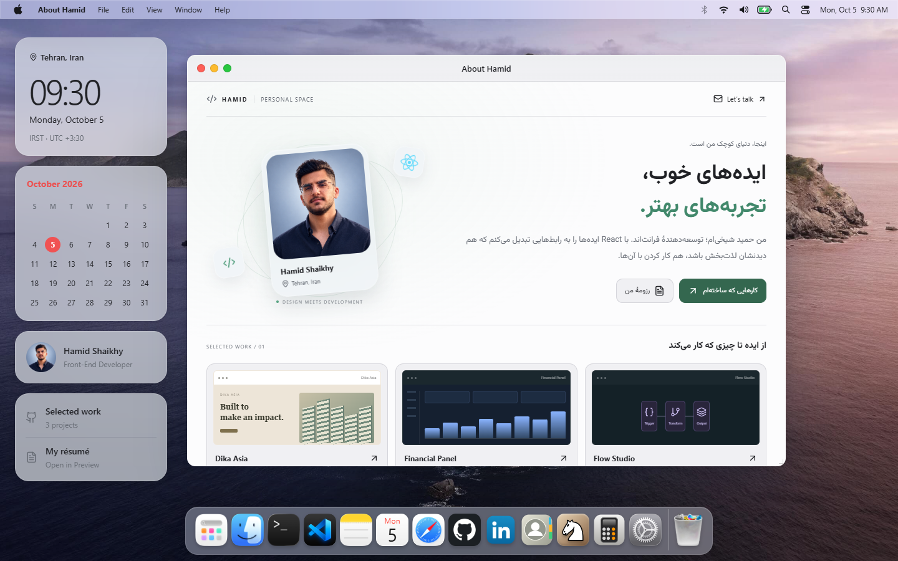](docs/screenshots/desktop-light.png)

## یک فضای شخصی، چند راه برای کشف کردن

HamidOS پورتفولیوی **Hamid Shaikhy / حمید شیخی**، توسعه‌دهندهٔ فرانت‌اند است. معرفی، پروژه‌ها، ابزارها، رزومه و راه‌های تماس در قالب برنامه‌های یک محیط الهام‌گرفته از macOS و iOS کنار هم قرار گرفته‌اند. می‌توانید پنجره‌ها را جابه‌جا کنید، نام برنامه‌ای را جست‌وجو کنید، یادداشت بنویسید، در تقویم برنامه بچینید یا کمی شطرنج بازی کنید.

متن‌های شخصی فارسی‌اند و کنترل‌های برنامه‌ها عمدتاً انگلیسی. اجرای پروژه به بک‌اند، حساب کاربری یا کلید API نیاز ندارد.

| کشف | کار کردن | شخصی‌سازی |
| :--- | :--- | :--- |
| معرفی، GitHub داخلی، پروژه‌ها و مخاطبین | فایل‌ها، یادداشت، ویرایشگر، تقویم و ماشین‌حساب | تم روشن و تیره، والپیپر، Dock و کنترل‌های نمایشی |

<a id="gallery"></a>

## گالری تصاویر

تصاویر زیر با مرورگر از **خود برنامه** ثبت شده‌اند. روی هر تصویر بزنید تا نسخهٔ کامل را ببینید. پیش‌نمایش‌های کوچکِ داخل کارت پروژه‌ها، تصویرسازی رابط هستند.

### دسکتاپ؛ روشن و تیره

صفحهٔ معرفی با تصویر شخصی، متن کوتاه و کارت‌های منتخب باز می‌شود. ویجت‌های سمت چپ دسترسی مستقیم به معرفی، پروژه‌ها، رزومه و تقویم می‌دهند؛ Dock برنامه‌های روزمره را کنار هم نگه می‌دارد.

[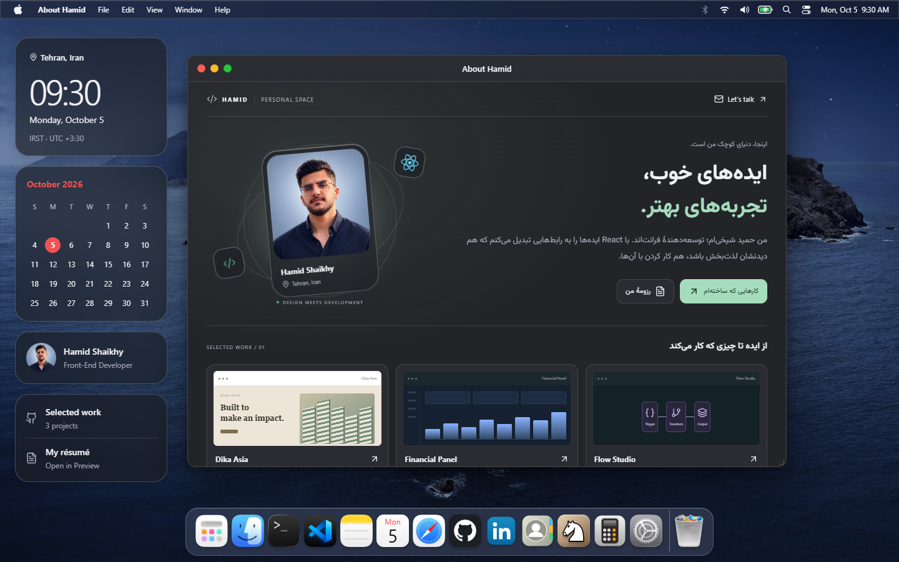](docs/screenshots/desktop-dark.png)

### پروژه‌ها و پروفایل

GitHub یک صفحهٔ داخلی با معرفی، لوگوی ابزارها و پروژه‌های منتخب است. از آن می‌توان وارد جزئیات پروژه شد و نقش، چالش و نتیجهٔ هر کار را دید.

| GitHub داخل HamidOS | مجموعهٔ پروژه‌ها |
| :---: | :---: |
| [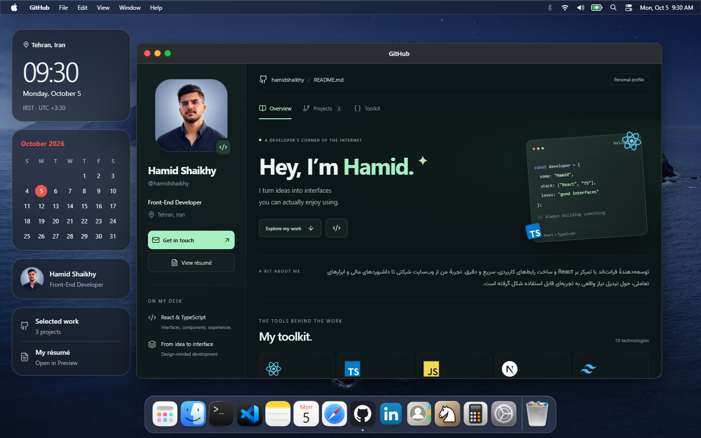](docs/screenshots/github-desktop.png) | [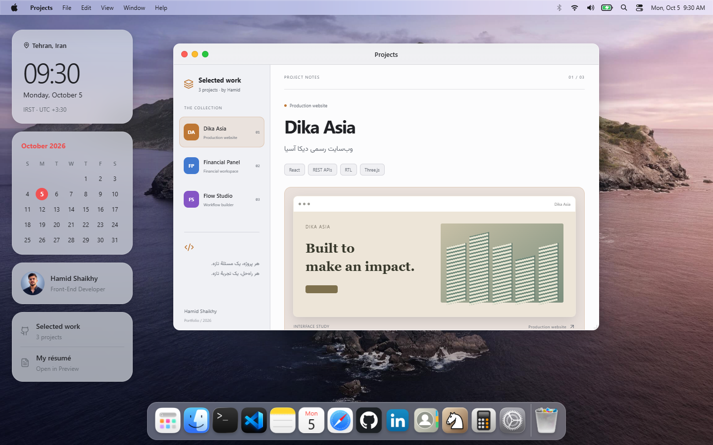](docs/screenshots/projects-desktop.png) |
| معرفی و ابزارها، در یک پنجرهٔ مستقل | پیش‌نمایش رابط، انتخاب پروژه و شرح کار |

### ابزارهای کوچک، جزئیات کاربردی

تقویم در هر دو تم با محیط هماهنگ است. روی **هر قسمت خالی خانهٔ یک روز** بزنید تا فرم رویداد با همان تاریخ باز شود؛ رویدادها بعد از تازه‌کردن صفحه باقی می‌مانند.

| تقویم روشن | تقویم تیره |
| :---: | :---: |
| [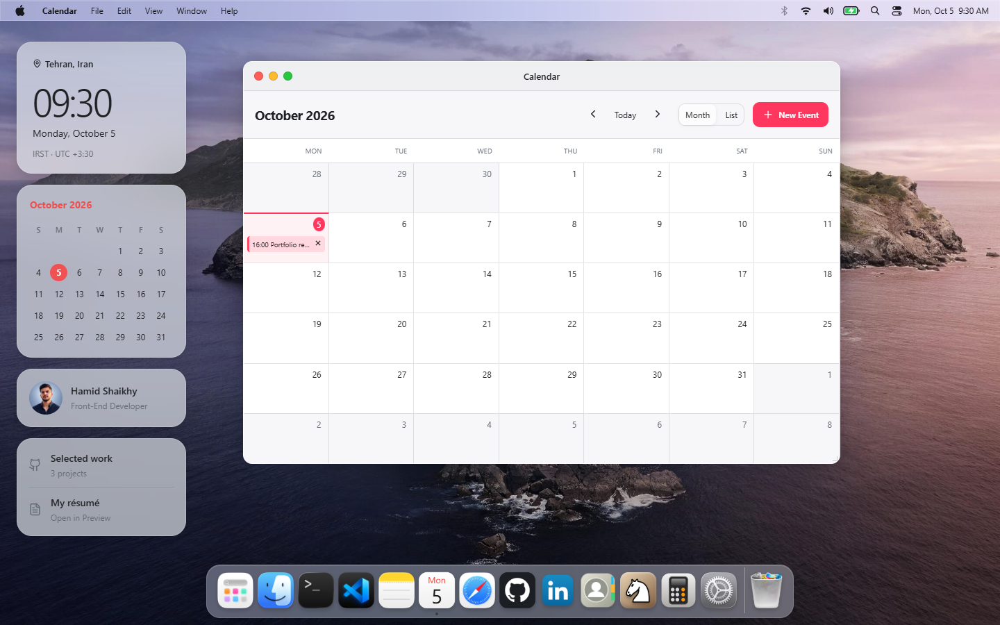](docs/screenshots/calendar-light.png) | [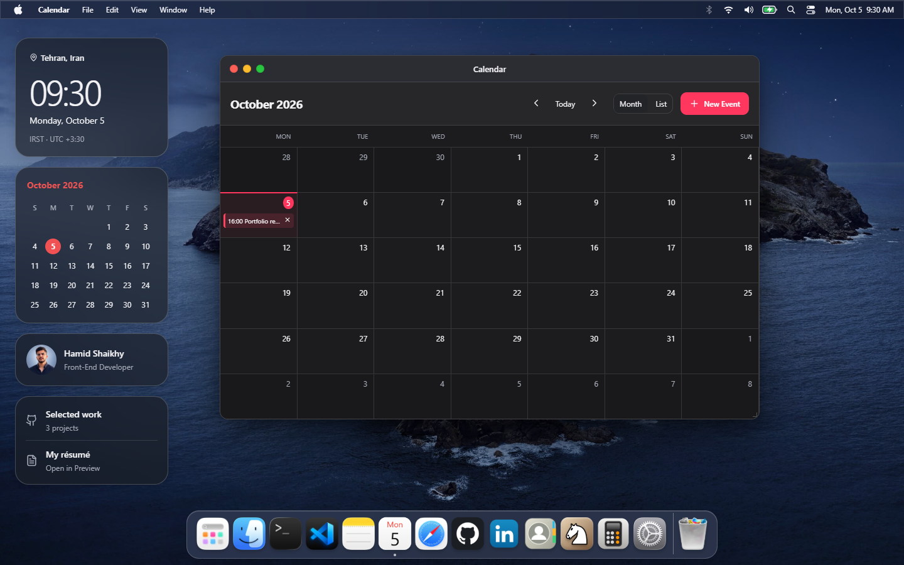](docs/screenshots/calendar-dark.png) |

| ماشین‌حساب جمع‌وجور | مرکز اعلان‌ها | Spotlight |
| :---: | :---: | :---: |
| [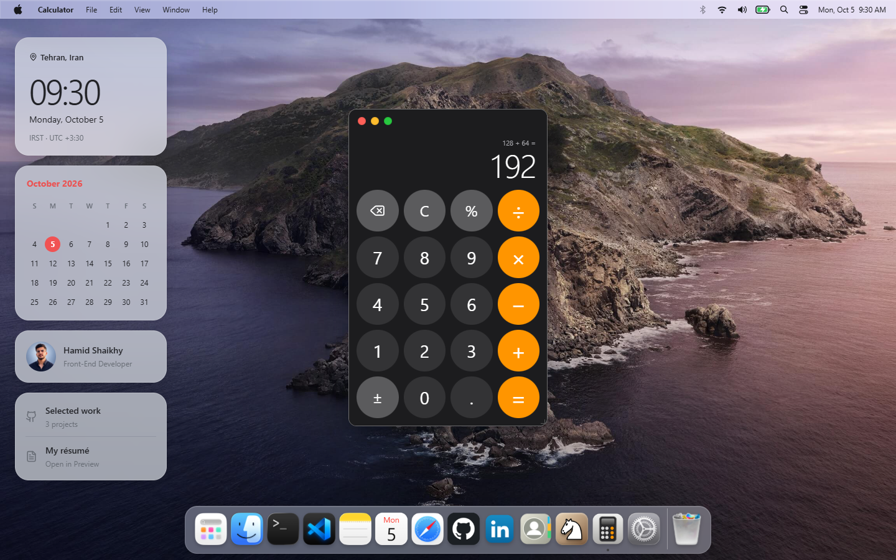](docs/screenshots/calculator-desktop.png) | [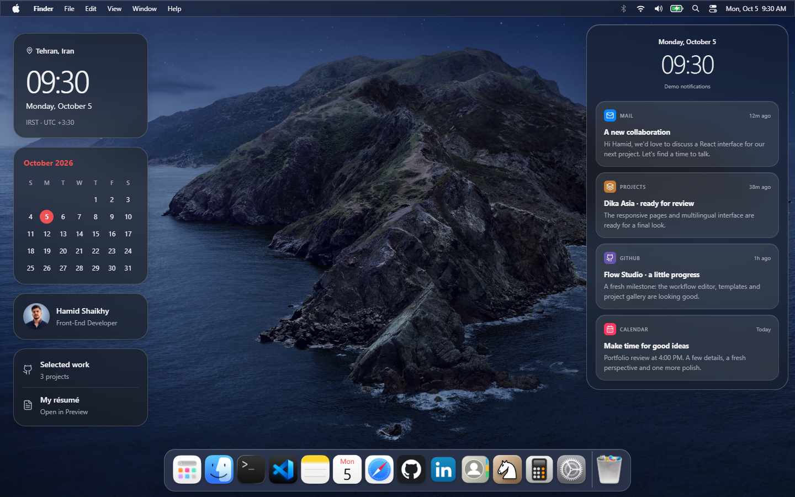](docs/screenshots/notifications-desktop.png) | [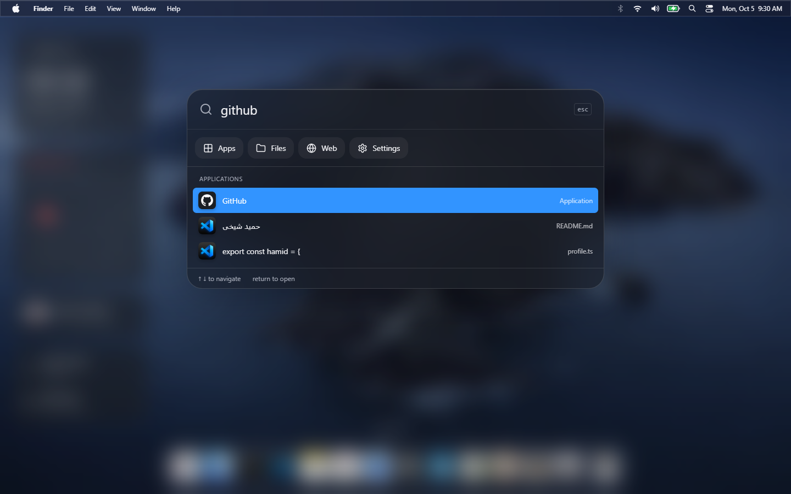](docs/screenshots/spotlight-desktop.png) |
| کلیدهای گرد، محاسبه با کلیک یا کیبورد | کارت‌های نمایشی؛ با کلیک روی تاریخ منوی بالا | پیدا کردن برنامه با نام انگلیسی یا فارسی |

### فضای کار و راه‌های تماس

| مخاطبین | ویرایشگر کد |
| :---: | :---: |
| [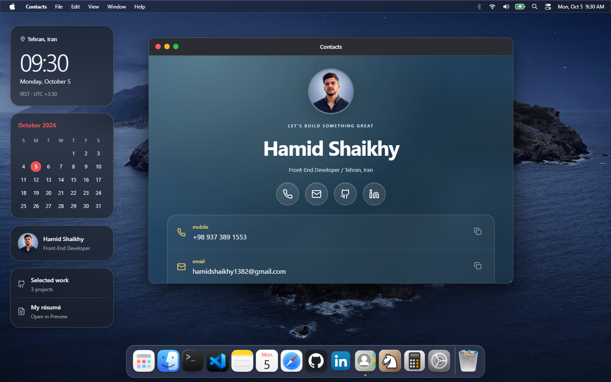](docs/screenshots/contacts-desktop.png) | [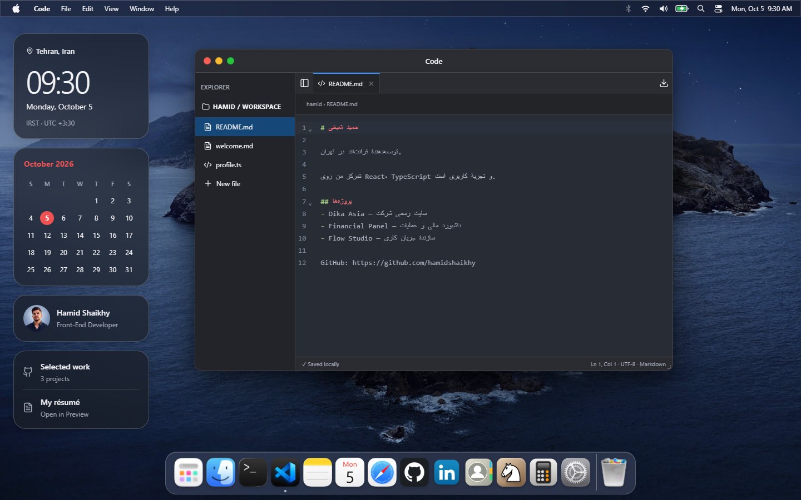](docs/screenshots/workspace-desktop.png) |
| اطلاعات تماس و شماره با پیش‌شمارهٔ ‎+98 | فایل مشترک با Finder، Notes و Terminal |

| شطرنج | انتخاب والپیپر |
| :---: | :---: |
| [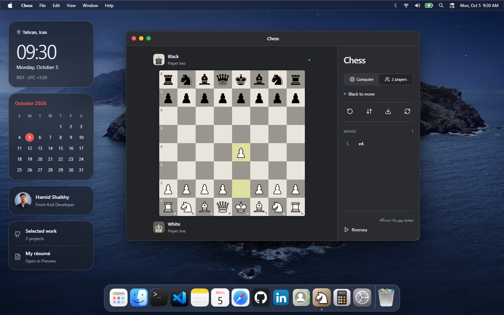](docs/screenshots/chess-desktop.png) | [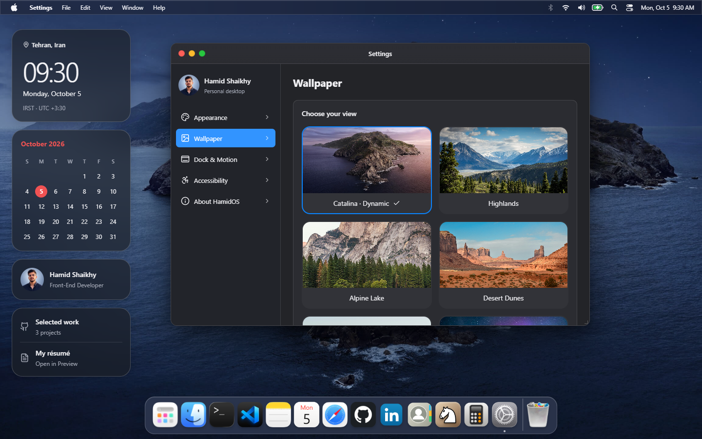](docs/screenshots/settings-desktop.png) |
| بازی با رایانه یا دو نفر روی یک دستگاه | پس‌زمینه‌های محلی و انتخاب مستقل از تم |

### گوشی؛ همان برنامه‌ها، چیدمانی برای لمس

برنامه‌های Dock دسکتاپ در صفحهٔ خانه و Dock گوشی هم در دسترس‌اند. ماشین‌حساب در Dock پایین قرار دارد؛ **Selected work** و **My résumé** زیر ویجت‌ها باز می‌شوند. همهٔ آیکون‌ها در یک صفحه جا می‌شوند، حتی روی نمایشگر ۳۲۰×۵۶۸. در حالت افقی، جست‌وجو دسترسی به معرفی را هم حفظ می‌کند.

| صفحهٔ خانه | نمایشگر کوچک | ماشین‌حساب | مخاطبین |
| :---: | :---: | :---: | :---: |
| [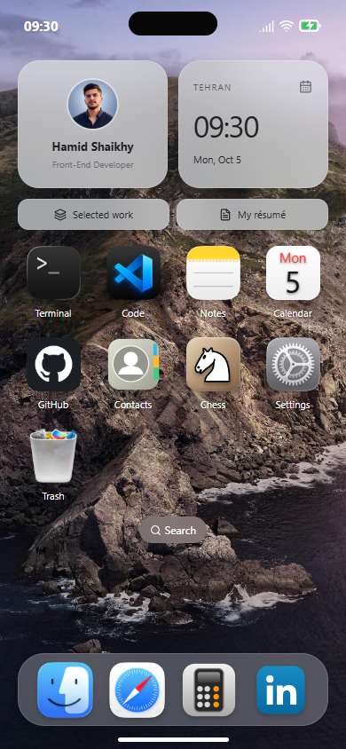](docs/screenshots/mobile-home.png) | [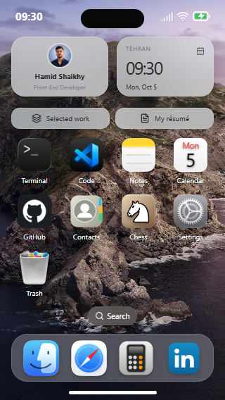](docs/screenshots/mobile-home-small.png) | [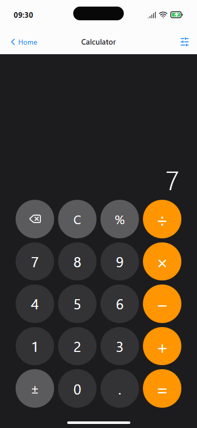](docs/screenshots/mobile-calculator.png) | [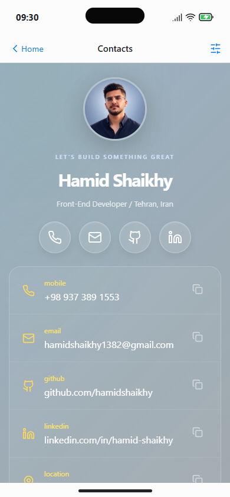](docs/screenshots/mobile-contacts.png) |

<a id="features"></a>

## امکانات

- **محیط دسکتاپ:** جابه‌جایی، تغییر اندازه، بستن و کوچک‌کردن پنجره‌ها؛ دکمهٔ سبز کل فضای مرورگر را می‌گیرد و با کلیک دوباره اندازهٔ قبلی برمی‌گردد.
- **پورتفولیو:** معرفی شخصی، سه پروژهٔ منتخب، GitHub داخلی با لوگوی ابزارها، پروفایل LinkedIn و کارت مخاطبین با لینک تماس و کپی اطلاعات.
- **رزومه:** PDF دوصفحه‌ای در Preview، با لایهٔ متن، بندانگشتی، زوم، اندازهٔ مناسب صفحه و دریافت اصل فایل.
- **فضای کار محلی:** Finder، Notes با پیش‌نمایش Markdown، ویرایشگر CodeMirror، Terminal با دستورهای فایل و Trash برای بازگردانی فایل حذف‌شده.
- **تقویم و محاسبه:** نمای ماه و فهرست رویدادها، افزودن و حذف رویداد، محاسبات اعشاری، درصد، تغییر علامت و ورودی کیبورد.
- **جست‌وجو:** Spotlight با دسته‌های برنامه‌ها، فایل‌ها، وب و تنظیمات؛ اولویت نتیجهٔ مرتبط و پس‌زمینهٔ محو. Launchpad هم فهرست کامل برنامه‌ها را دارد.
- **ظاهر:** شیشهٔ محو، تم روشن و تیره، چند والپیپر، بزرگ‌شدن آیکون‌های Dock، کاهش حرکت و تنظیم روشنایی صفحه.
- **کنترل‌ها و اعلان‌ها:** Wi-Fi، Bluetooth و AirDrop با وضعیت نمایشی مستقل؛ باتری سبز با نشان شارژ و اعلان‌های نمونهٔ ایمیل و پروژه.
- **گوشی:** صفحهٔ خانه، Dock چهار جایگاه، برنامه‌های تمام‌صفحه، کنترل‌سنتر، قفل نمایشی و برگشت به خانه؛ چیدمان افقی و عمودی.
- **شطرنج و موسیقی:** حرکت قانونی، بازی با موتور داخل Worker یا دو نفرهٔ محلی؛ پخش، توقف، جابه‌جایی زمان و صدای مشترک بین بخش‌های برنامه.

<a id="start"></a>

## اجرای محلی

**پیش‌نیاز:** Node.js نسخهٔ ۲۲٫۱۳ یا جدیدتر و npm. داخل پوشهٔ پروژه:

```bash
npm ci
npm run dev
```

برنامه را در **[http://localhost:4173](http://localhost:4173)** باز کنید. اگر پورت اشغال باشد، Vite آدرس آزاد را در ترمینال نشان می‌دهد.

برای یک بازدید کوتاه:

1. معرفی را ببینید و از کارت‌ها وارد پروژه‌ها شوید.
2. GitHub و Contacts را از Dock باز کنید.
3. در Spotlight عبارت `github` را جست‌وجو کنید.
4. روی خانهٔ یک روز تقویم بزنید و یک رویداد بسازید.
5. از Settings تم یا والپیپر را عوض کنید؛ انتخاب بعد از refresh باقی می‌ماند.

### ساخت و پیش‌نمایش

```bash
npm run build
npm run preview
```

خروجی `dist/` برای میزبانی استاتیک آماده است. آن را از یک سرور HTTP ارائه کنید. برای مسیر فرعی، مانند `/hamidos/`:

```bash
npm run build -- --base /hamidos/
```

<a id="architecture"></a>

## ساختار پروژه

```text
src/
├─ apps/             برنامه‌های مستقل و قابل بارگیری جداگانه
├─ components/       پوسته، پنجره‌ها، Dock، ویجت‌ها و پنل‌ها
├─ lib/              محتوای شخصی، فایل‌ها، محاسبات و موتور شطرنج
├─ state/            وضعیت محیط، فایل‌ها و موسیقی
└─ test/             تست‌های واحد و تعاملات React
public/assets/       تصاویر، آیکون‌ها، قلم، رزومه و موسیقی
tests/browser/       سناریوهای واقعی مرورگر
docs/screenshots/    تصاویر قابل نمایش در GitHub
scripts/            آماده‌سازی دارایی‌ها و ثبت تصاویر
```

React و TypeScript رابط را می‌سازند، Zustand وضعیت را مدیریت می‌کند و Vite برنامه‌ها و Workerها را بسته‌بندی می‌کند. PDF.js نمایش رزومه و CodeMirror ویرایش فایل را انجام می‌دهند. منطق محاسبه و فایل‌های مشترک از رابط جداست؛ برنامه‌های سنگین هنگام بازشدن بارگیری می‌شوند.

### تغییر محتوا

| بخش | فایل |
| :--- | :--- |
| هویت، لینک‌ها، شماره و پروژه‌ها | [`src/lib/content.ts`](src/lib/content.ts) |
| برنامه‌ها و ترتیب Dock | [`src/lib/apps.ts`](src/lib/apps.ts) |
| اندازهٔ اولیهٔ پنجره‌ها | [`src/lib/windows.ts`](src/lib/windows.ts) |
| فهرست و آیکون ابزارها | [`src/lib/toolkit.ts`](src/lib/toolkit.ts) |
| والپیپرها | [`src/lib/wallpapers.ts`](src/lib/wallpapers.ts) |
| اعلان‌های نمونه | [`src/components/NotificationCenter.tsx`](src/components/NotificationCenter.tsx) |
| رزومه و تصویر شخصی | `public/assets/resume.pdf` و `public/assets/avatar.png` |

بعد از جایگزینی PDF یا MP3، `npm run dev` یا `npm run build` فایل همراه داده را خودکار آماده می‌کند؛ این همراه بایت‌های همان اصل فایل را دارد. توضیحات کامل‌تر در [معماری](docs/ARCHITECTURE.md) آمده است.

### داده و رفتار محیط

یادداشت‌ها، فایل‌های ساخته‌شده، رویدادها، تنظیمات و وضعیت بازی در مرورگر همان دستگاه ذخیره می‌شوند؛ همگام‌سازی ابری وجود ندارد. `localhost` و `127.0.0.1` فضای ذخیرهٔ جدا دارند.

کلیدهای اتصال، باتری و قفل نمایشی‌اند و تنظیمات سیستم‌عامل را تغییر نمی‌دهند. اعلان‌ها نمونهٔ ثابت هستند و به ایمیل واقعی وصل نیستند. پروفایل GitHub از محتوای آمادهٔ محلی ساخته شده است؛ لینک‌های خارجیِ مشخص، مقصد واقعی را در مرورگر باز می‌کنند. Terminal با فایل‌های مجازی همین برنامه کار می‌کند.

<a id="checks"></a>

## بررسی و بازتولید تصاویر

```bash
npm test
npx tsc --noEmit --noUnusedLocals --noUnusedParameters
npm run build
npm run test:browser:install
npm run test:browser
```

تست‌ها چرخهٔ پنجره، فایل‌های مشترک، حساب، PDF، صدا، جست‌وجو، تقویم، تم و چیدمان گوشی را بررسی می‌کنند. بررسی تازهٔ پوسته شامل اندازهٔ کوچک ماشین‌حساب، اعلان‌های بدون اقدام، سفیدی تقویم و جاگرفتن تمام آیکون‌ها در چهار اندازهٔ گوشی است. نتیجه‌ها و محدودیت بررسی روی دستگاه واقعی در [QA](docs/QA.md) ثبت شده‌اند.

برای ساخت دوبارهٔ همین تصاویر از نسخهٔ production:

```bash
npm run build
npm run screenshots
```

تصاویر در `docs/screenshots/` قرار می‌گیرند و همراه README وارد مخزن می‌شوند. اسکریپت با ساعت ثابت، مرورگر تازه و دادهٔ نمایشی اجرا می‌شود؛ ذخیرهٔ مرورگر شخصی را تغییر نمی‌دهد. روی Windows از Chrome نصب‌شده استفاده می‌کند؛ در محیط‌های دیگر می‌توان Chromium را با `npx playwright install chromium` آماده کرد. گزارش‌های موقت تست در `artifacts/` ذخیره می‌شوند.

## میان‌برها

| کلید | کار |
| :--- | :--- |
| `Ctrl / Cmd + Space` | بازکردن Spotlight |
| `↑ / ↓` و `Enter` | انتخاب و بازکردن نتیجه |
| `Escape` | بستن پنل؛ پاک‌کردن ماشین‌حساب وقتی فعال است |
| `Ctrl / Cmd + N` | یادداشت جدید |
| `Ctrl / Cmd + W` / `M` | بستن / کوچک‌کردن پنجرهٔ فعال |
| `Ctrl + Cmd + Q` | قفل نمایشی |
| `↑ / ↓ / Tab` در Terminal | تاریخچه و تکمیل مسیر |
| `Tab / Shift + Tab` در Code | تورفتگی کد |
| اعداد، `+ - * / % =` و `Backspace` | محاسبه با کیبورد |

## سازنده و اعتبارها

ساخته‌شده برای **حمید شیخی** · [GitHub](https://github.com/hamidshaikhy) · [LinkedIn](https://www.linkedin.com/in/hamid-shaikhy/) · [Email](mailto:hamidshaikhy1382@gmail.com)

الهام بصری از [ThanasOS](https://thanasos.thanas.dev/) و [playground-macos](https://portfolio.zxh.me/). کد برنامه با مجوز [MIT](LICENSE) ارائه شده؛ مجوز دارایی‌های شخصی، موسیقی، برندها و آثار دیگر جداست. منابع و متن مجوزها در [ATTRIBUTIONS.md](ATTRIBUTIONS.md) و [`licenses/`](licenses/) نگهداری می‌شوند.
